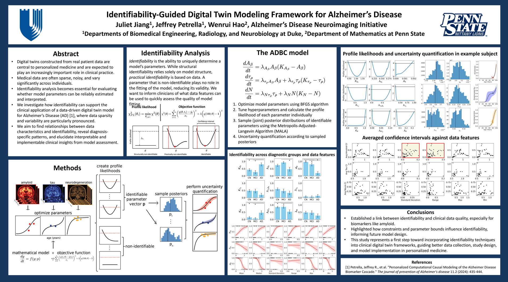
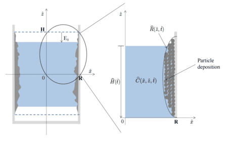
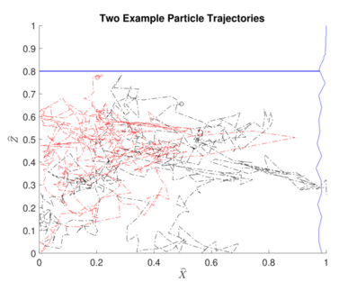

This page is still under construction.

* ## Identifiability-Guided Assessment of Digital Twins in Alzheimer’s Disease Clinical Research and Care ([BioRxiv Paper](https://www.biorxiv.org/content/biorxiv/early/2025/08/22/2025.08.17.670697.full.pdf))
  In this work, we assess the practical identifiability of parameters in personalized Alzheimer's disease models and use these results to inform downstream uncertainty quantification. This study presents a first step toward incorporating identifiability techniques into clinical digital twin frameworks. Undergraduate work with Dr. Jeffrey Petrella (Duke University) and Dr. Wenrui Hao (Penn State).

  Preprint: **Juliet Jiang**, Jeffrey R. Petrella, Wenrui Hao, for the Alzheimer’s Disease Neuroimaging Initiative. BiorXiv. (Preparing submission)

  
    
* ## Personalized Computational Causal Modeling of the Alzheimer Disease Biomarker Cascade ([JPAD paper](https://www.sciencedirect.com/science/article/pii/S2274580724000918))
    In this paper, we aimed to investigate the feasibility of personalizing a causal model of Alzheimer's Disease progression using longitudinal biomarker data. Our work supports the feasibility of personalizing mechanistic models based on individual biomarker trajectories and suggests that this approach may be useful for reclassifying subjects on the Alzheimer's clinical spectrum by endophenotypic profiles.

    Petrella, J. R., **Jiang, J.**, Sreeram, K., Dalziel, S., Doraiswamy, P. M., Hao, W., & Alzheimer's Disease Neuroimaging Initiative. (2024). Personalized computational causal modeling of the Alzheimer disease biomarker cascade. The journal of prevention of Alzheimer's disease, 11(2), 435-444.

* ## Identifying When Steady-State Flow Simulations In Patient-Specific Coronaries Recapitulate Pulsatile Flow Dynamics ([IEEE EMBC Paper](https://pmc.ncbi.nlm.nih.gov/articles/PMC12233029/))
    Computational fluid dynamics (CFD) models provide a non-invasive means of assessing coronary artery disease, but physiologically realistic pulsatile simulations are computationally expensive. In this work, we compared steady-state and pulsatile simulations in patients with stenosed coronary arteries to determine whether simpler steady-state models can accurately reproduce key hemodynamic metrics—including fractional flow reserve (FFR), velocity, vorticity, and wall shear stress—across the cardiac cycle. Undergraduate work with Dr. Amanda Randles.

    **Jiang J** (co-first), Huber M (co-first), Tanade C, Randles A. Identifying When Steady-State Flow Simulations In Patient-Specific Coronaries Recapitulate Pulsatile Flow Dynamics. Annu Int Conf IEEE Eng Med Biol Soc. 2024;2024:1-4. doi:10.1109/EMBC53108.2024.10781714

* ## Particle Deposition Driven by Evaporation in Membrane Pores and Droplets ([SIAM SIURO Paper](https://www.siam.org/media/0ifh2tz1/s153293rrr.pdf))
    In this paper, we examined how evaporation can compete with influences of diffusion and deposition in a particle-ladened fluid. For diffusion-dominated problems, PDEs and SDEs for particle transport were studied to observe deposition behavior on solid boundaries produced in different parameter regimes. Computationally scaled 2D models were then simulated to obtain the temporal evolution of the particle concentration and deposition patterns in a rectangular pore and also for sessile drops on flat solids. Undergraduate work with Dr. Thomas Witelski.
     

    **Jiang, Juliet**, Ruohan Zhang, and Dominic Jeong. "Particle Deposition Driven by Evaporation in Membrane Pores and Droplets." SIAM Undergraduate Research Online 16 (2023).

* ## Other posters
  * ### Hemodynamic sensitivity to heart-rate in the coronary arteries (BMES 2023)

  

